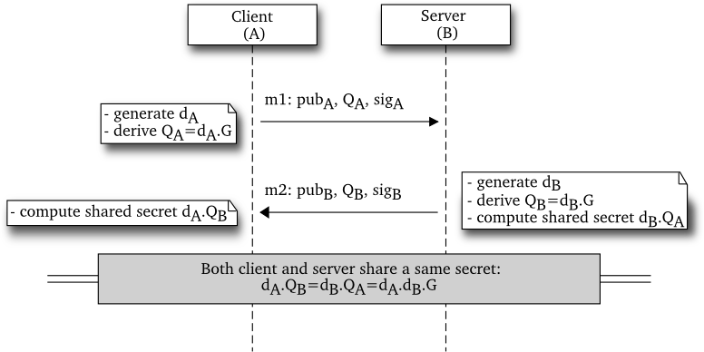

A simple ECC certificate library
================================

This code implements a simple certificate format based on ECC. The purpose of
this type of certificate is to be very light to transport and have a very small
memory footprint. Currently, a single certificate is encoded on less than  144
bytes (for its public components).

In order to further minimize the memory footprint, a node's certificate is
encoded in a C array and embedded within the code. Consequently, there is no
need to read the certificate from the ROM, for example.

The code here is presented as an example for the [Contiki OS][contiki], but can
easily be ported to other systems (as long as these systems support a C
compiler).

Design choices
--------------

We use two "flavors" of certificates:
- *private certificate*:  this certificate remains on the node and is used for
  signature generation
- *public certificate*: this certificate is presented to other nodes and
  transported over the air

The private certificate contains the secret that helped deriving
the coordinates on the curve. The public certificate can be derived from the
private certificate.

Both variants contains:
- X and Y coordinates on the curve (public parameters)
- hash of the public certificate of the signing party (this is filled with zeros if there is no signing party)
- signature of the certificate using the signing party certificate (this is filled with zeros if there is no signing party)

In order to decrease the size and complexity, a few parameters are omitted or
implicit:
- curve definition is fixed at compile time
- base point is omitted
- no data encoding (ASN.1, DER, etc.)
- unless specified otherwise, data are stored and transported in the big endian ordering

Data structures required for provisioning a node
------------------------------------------------

### Trust anchors

One or more certificates can serve as trust anchors and be stored on a node.
These certificates are used for establishing a certificate path when validating
others node certificate.

Trust anchors are stored in a way that enable it to be processed without any
endianness conversion.

### Node's own certificate

A node stores its own private certificate.

### Node's certificate path intermediate certificates

This is the list of all the certificates in the path from the node's own
certificate to the trust anchor (both of them are omitted). If the node's
certificate was signed by a trust anchor, this list is empty.

For practical purposes, the certificates in this list must be directly encoded
in the format they are transported over the wire.

How to compile
--------------

Upon retrieve the sources, you need to initialise the Contiki git submodule:

    git submodule init
    git submodule update

If you want to build the Contiki example, based on the *ipv6/rpl-udp* example,
you can run the regular make command:

    make

If you want to build the example and the tests, you can run the following command:

    make extra

If you intend to build for a target different than native, say RedBee Econotag,
you have to to specify the corresponding TARGET variable:

    make TARGET=econotag

Please note that only one ECC curve can be enabled at a time. You can change it
by editing the *Makefile.curve* file. You then need to recompile all the code
to use this new curve.

Simplistic authentication protocol
----------------------------------

In order to illustrate the library, the Contiki udp-client and udp-server, as
well as the standalone example-client and example-server, we implement a
simplistic certificate-based authentication scheme.

The scheme works as follows:

Where:
* G is the base point on the curve. It is a common parameter (i.e. hardcoded)
to both the client (A) and the server (B).
* *pubA* and *pubB* are respectively the client and the
server’s public certificates.
* *sigA* and *sigB* are respectively the client and the server’s signature
  performed over the whole message using the private key associated to their
  certificates.
* *QA* and *QB* are ECDH ephemeral public keys.
* *dA* and *dB* are ECDH ephemeral private keys.

The scheme works in the following way:
* upon receiving *m1* the server verifies that the
public certificate *pubA* has been issued by a trusted
certificate authority. Then it verifies the signature *sigA*.
If the signature is valid, it computes the shared secret
*dB.QA*.
* upon receiving *m2* the client also verifies *pubB* and
*sigB*. If both of them are valid, it computes the shared
secret *dA.QB*.

Note that this key exchange is just an example and is in no way robust to
attacks (replay attacks would be trivial here).

Using the examples
------------------

The library comes with one example client server in the *example* directory.
The server listen by default on the IPv4 address 127.0.0.1 on the TCP port
9999. It can be started with the following command:

    ./example-server

The client is started in an analogous manner:

    ./example-client

Upon a successful authentication, a shared secret is derived. All the client's
input will then be transmitted to the server through a very robust XOR based
encryption (using the shared secret as the key).

Using the standalone tools
--------------------------

*gen-cert* and *sign-cert* work on certificates that are read and stored in
"raw" format (dump of the C structure) inside files. When the certificate needs
to be embedded into the code, the *convert-cert-to-carray* tool translates the
raw certificate in a C array. This is useful for generating certificates on
your computer and storing them in embedded devices.

### gen-cert

Generate a certificate.

    ./gen-cert outputfile [issuer]

When the *issuer* is provided, the certificate will be signed by the issuer certificate.

### sign-cert

Sign a certificate with an other certificate.

    ./sign-cert certfile signing-party

This will sign the certificate in *certfile* with the certificate in the *signing-party*.

### convert-cert-to-array

Convert a dumped certificate into a C array (for inclusion within C code). Note
that this operation serialize the certificate before printing, it must be
unserialized before use.

    ./convert-cert-to-array [-p] certfile varname

The *-p* flag will export only the public portion of the certificate in the C array.

Example of use (where *cert-file* is a file containing a raw certificate):

    > ./convert-cert-to-array -p cert-file mycert
    uint8_t mycert [168] = {50, 78, 28, 96, 1C, 73, 76, 7B, 43, 7E, 62, 3E, A9, C8,
    4A, 9A, 6C, DD, 8B, 0B, AD, A5, C0, BA, A3, 15, D3, 4C, BB, BB, 7E, 76, C2, 51,
    19, FE, A1, 0A, 2C, 6A, C6, 07, 62, 1A, 72, F3, A1, 43, 27, 45, 8B, 56, DF, C6,
    D2, F5, 75, 68, 7F, F6, 0D, 74, A6, BC, 80, 4E, 84, 73, A7, 00, 7E, 5A, 4E, 5F,
    D3, 91, 0A, 6D, AD, 35, 27, FE, 14, DB, F1, FD, AF, AE, 00, 30, BD, 73, E7, FA,
    D8, 2C, CB, A3, CD, 8D, C8, 03, B8, 32, A3, 57, 6D, 54, 92, 39, F2, 78, F5, 89,
    21, BF, FE, 80, 8D, DF, C7, 93, 52, D5, 71, 48, 79, 81, 00, 00, 00, 00, 29, E8,
    C9, 24, 18, 41, 31, CF, 3D, EF, 7E, 0D, 3A, 60, 16, CD, 22, DD, 79, 02, 36, 58,
    C9, 36, 26, 2F, 76, BE, F8, 80, 0C, 5D, 00, 00, 00, 00};

<!-->
Using ECDH to exchange a key
----------------------------

ECDH enables two party to exchange a secret. Here, we use an hardcoded
generator point (param.G in the code) to perform the
ECDH exchange and provide additional helper functions.

Here is an example of code:
TBD

Note that this code only works when two nodes communicating are together.
-->

External libraries embedded
---------------------------

Some of these libraries have been extracted from the [TinyDTLS][] source code.
This means that the code we use might different from the original as it as been
modified to work with TinyDTLS.

### SHA-256 implementation

Initial implementation from [Aaron Gifford](http://www.aarongifford.com/computers/sha.html).
Modified by an unknown person to enable/disable SHA-384 and SHA-512 at build time.

### ECC implementation

We use a slightly modified version of [ContikiECC][] (which itself is a C port of the [TinyECC][] library).

We previously used the ECC implementation used in [TinyDTLS][] (initially from
Chris K. Cockrum) but found it to be too slow. However, this implementation was
also had a smaller footprint (~7kB of ROM compared to ~8.5kB with ContikiECC).

Notes
-----

* this library does not provide any equivalent of a "self-signed" certificate.
  This is because this code is intended to run on standalone devices and sensor
  nodes  don't have the capability to determine if a certificate must be
  trusted (unless there is a path to a Certificate Authority).
* the choice of the ECC curve name is hardcoded in the file *Makefile.curve*.
  Make sure that all the code is compiled with the same curve parameters.

Library performance
-------------------

### Storage space requirements

Because of our design choice, storage requirements for our light certificates are actually very low. Here is the actual storage size of a certificate for some popular curves:

<table>
<tr>
<th>Curve name</th>
<th>Pub. cert. size</th>
<th>Priv. cert. size</th>
</tr>
<tr>
<td>secp128r1</td>
<td>112B</td>
<td>132B</td>
</tr>
<tr>
<td>secp160k1</td>
<td>128B</td>
<td>152B</td>
</tr>
<tr>
<td>secp192k1</td>
<td>144B</td>
<td>172B</td>
</tr>
</table>

### Cryptographic operations performance

The [udp-client.c](udp-client.c) contains a *test_crypto()* function that runs all the
cryptographic operations in a loop. We used that code to determined the speed
of the different cryptographic primitives.  The file
[code_benchmark.ipynb](benchmark/code_benchmark.ipynb) contains a little script
to ease up the analysis of the raw data.
If you don't have IPython install, you might want to visualize it online through the [ipynbviewer](http://nbviewer.ipython.org/github/nist-emntg/ecc-light-certificate/blob/master/benchmark/code_benchmark.ipynb) website.

Contributors
------------

* Tony Cheneau <tony.cheneau@nist.gov>

Conditions Of Use
-----------------

The following licence applies for all the code in this repository that does not
belong to a third party:

<em>
This software was developed by employees of the National Institute of
Standards and Technology (NIST), and others.
This software has been contributed to the public domain.
Pursuant to title 15 United States Code Section 105, works of NIST
employees are not subject to copyright protection in the United States
and are considered to be in the public domain.
As a result, a formal license is not needed to use this software.
</em>

<em>
This software is provided "AS IS."
NIST MAKES NO WARRANTY OF ANY KIND, EXPRESS, IMPLIED
OR STATUTORY, INCLUDING, WITHOUT LIMITATION, THE IMPLIED WARRANTY OF
MERCHANTABILITY, FITNESS FOR A PARTICULAR PURPOSE, NON-INFRINGEMENT
AND DATA ACCURACY.  NIST does not warrant or make any representations
regarding the use of the software or the results thereof, including but
not limited to the correctness, accuracy, reliability or usefulness of
this software.
</em>

[contiki]: https://github.com/contiki-os/contiki
[ContikiECC]: http://score.ucsc.lk/projects/contikiecc
[TinyDTLS]: http://tinydtls.sourceforge.net/
[TinyECC]: http://discovery.csc.ncsu.edu/software/TinyECC/
